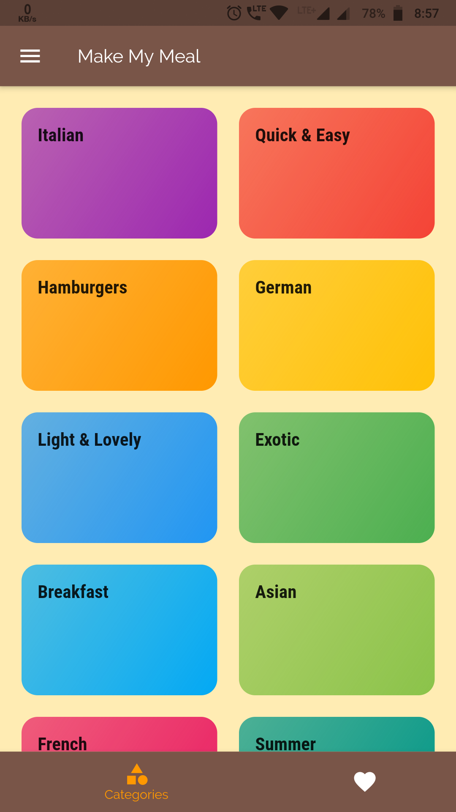
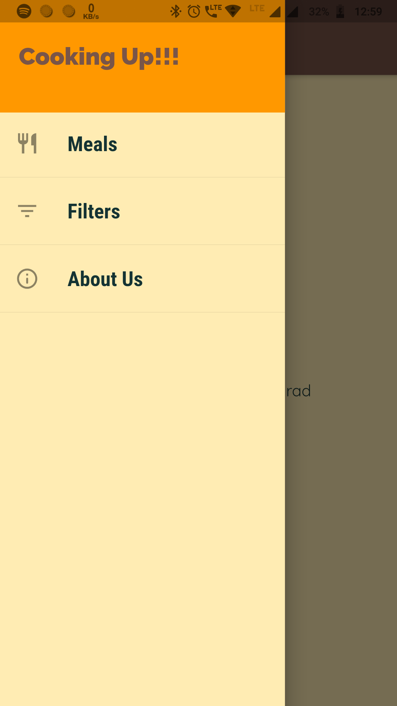
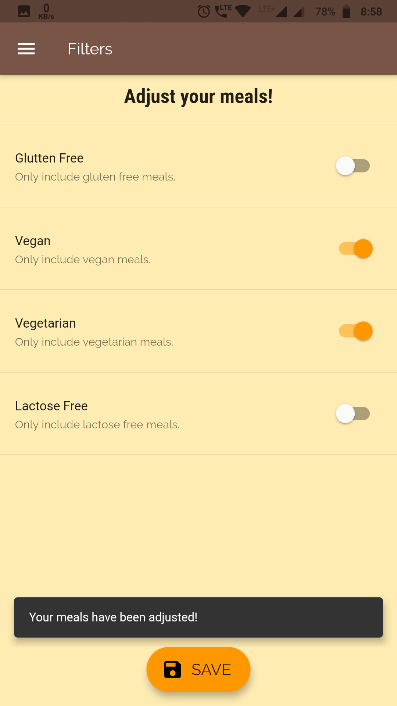
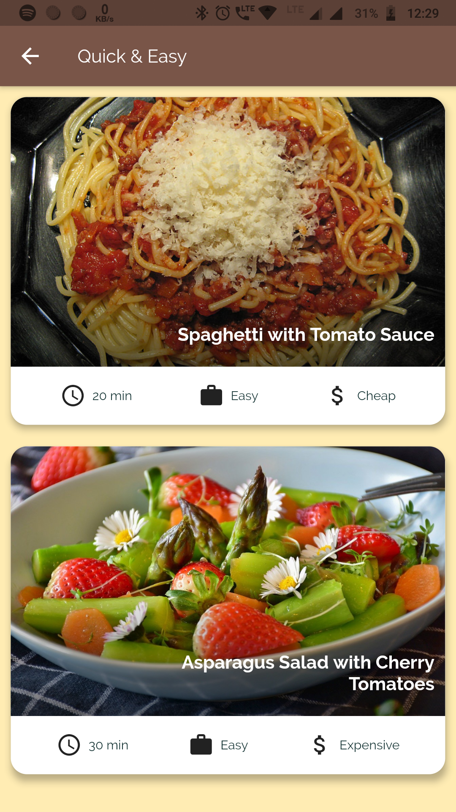
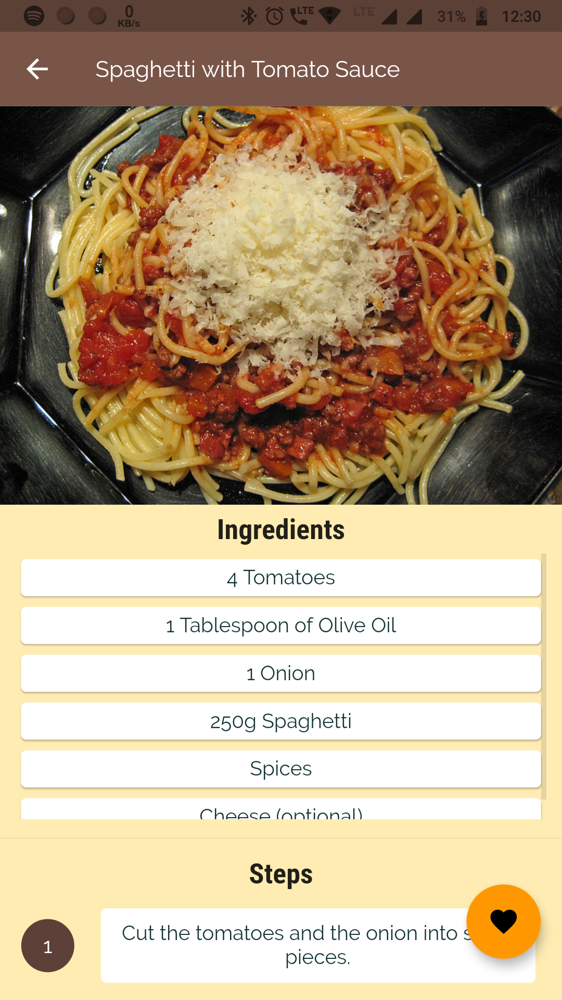
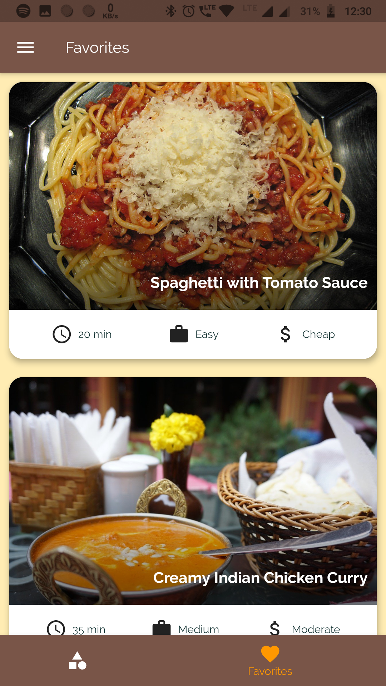

# MakeMyMeal App using Flutter

***Make My Meal***:spaghetti: provides recipe and other useful information for some of the popular delicious dishes. You can filter out different recipes according to your requirement and even mark them as favorite in case you find something interesting.

### Flutter Concepts:

- State management using *[Provider](https://pub.dev/packages/provider)*.
- Storing persistent data (like favorite meals) locally in the device using *[SharedPreferences](https://pub.dev/packages/shared_preferences)*.
- Navigating through multiple screens and argument passing.
- Flutter widgets (stateless and stateful) and styling.

## Features
- Filter out different recipes:hamburger:.
- Mark recipes as favorite:star:.
- Simple and intuitive UI:thumbsup:.
- Beautiful Material Design:eyeglasses:.
- Provides recipes for 10 tasty dishes:yum:.

## Screenshots

***Note***: App requires internet to load the images.

## Getting Started

This project is a starting point for a Flutter application.

A few resources to get you started if this is your first Flutter project:

- [Lab: Write your first Flutter app](https://flutter.dev/docs/get-started/codelab)
- [Cookbook: Useful Flutter samples](https://flutter.dev/docs/cookbook)

For help getting started with Flutter, view our
[online documentation](https://flutter.dev/docs), which offers tutorials,
samples, guidance on mobile development, and a full API reference.

